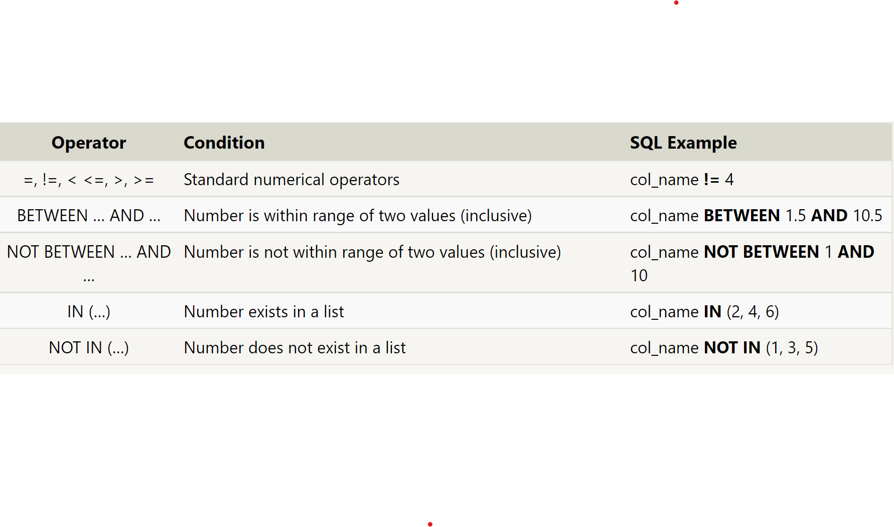

# SQL Pre Work Notes
[SQL Bolt Tutorial](https://sqlbolt.com/lesson/introduction)
## Select Queries
- a statement which declares what dta we are looking for, where to find it, and possibly how to transform
- EXAMPLE:
``` 
SELECT column, another_column
FROM mytable;
```
- You can get all the data from a table with this command
```
SELECT *
FROM mytable;
```

## Queries with Constraints
- The WHERE clause in a query is used to filter out data by checking specific column values to determine whether it should be included in the results
- EXAMPLE:
```
SELECT column, another_column
FROM mytable
WHERE condition
  AND/OR another_condition
```
