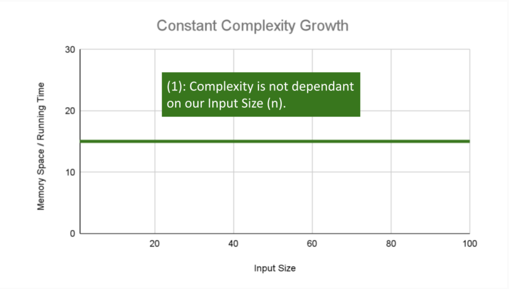
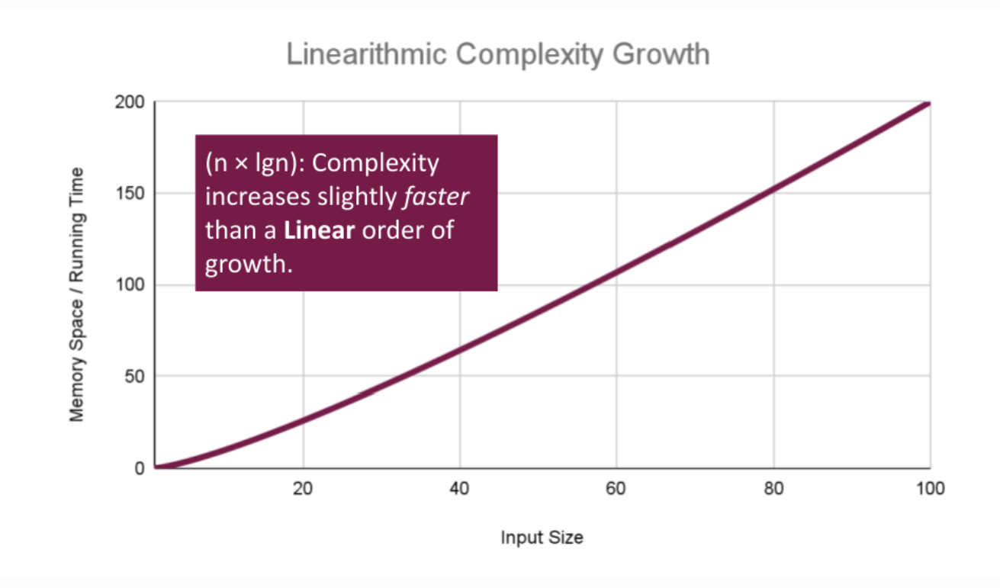

# Implementation: Linked Lists

## Summary

## BigO
- Describes the efficiency of an algorithm/function
  - Running time - amount of time a function needs to complete
  - memory space - amount of memory resources a function uses to store data and instructions

- BigO describes the worst case efficiency of an algorithm
- 4 Key Areas for analysis
  1. input size
    - size of the parameter values that are read by the algorithm
    - also accounts for the size of each parameter as well
  2. units of measurement
  - ***Time***
    - time in milliseconds from the start of function execution to it ends
    - number of operations executed
    - number of basic operations, refers to the operations that contribute the most to total running time
  - ***Space***
    - amount of space needed to hold code for the algorithm, bytes required to store the characters for instructions
    - amount of space required to hold the input
    - amount of space required to hold the output data
    - amount of space needed to hold the working space

  3. orders of growth

    
    
    
    
    
    
    
    

  4. best case, worst case, and average case
  - Worst Case: efficiency for worst possible input of size n
    - Big O
  - best case: efficiency for best possible input size n
    - Big Omega
  - average case: efficiency for a typical or random input 
  size of n
    - Big Theta

 - OVERVIEW
 
 

## Linked Lists

## Things I want to learn more about

### Links
[Big O: Analysis of Algorithm Efficiency](https://codefellows.github.io/common_curriculum/data_structures_and_algorithms/Code_401/class-05/resources/big_oh.html)

[Linked Lists](https://codefellows.github.io/common_curriculum/data_structures_and_algorithms/Code_401/class-05/resources/singly_linked_list.html)

[What’s a Linked List, Anyway? [Part 1]](https://medium.com/basecs/whats-a-linked-list-anyway-part-1-d8b7e6508b9d)

[What’s a Linked List, Anyway? [Part 2]](https://medium.com/basecs/whats-a-linked-list-anyway-part-2-131d96f71996)