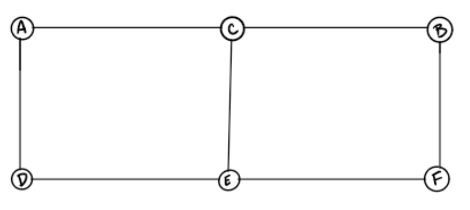
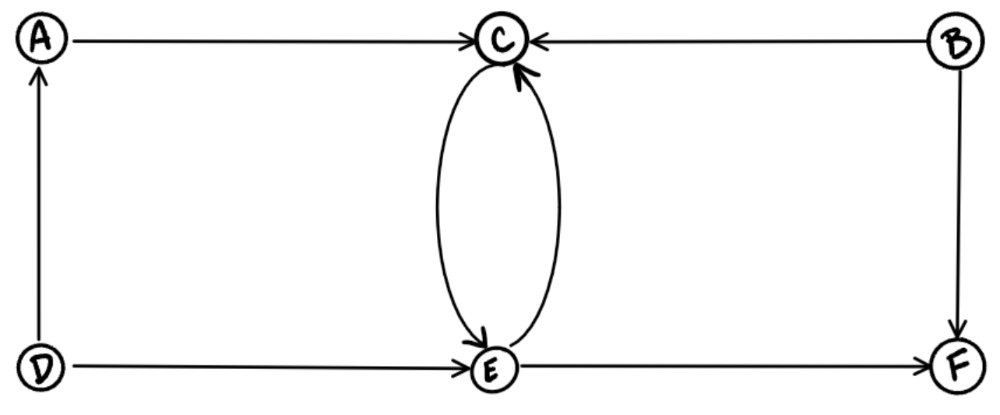
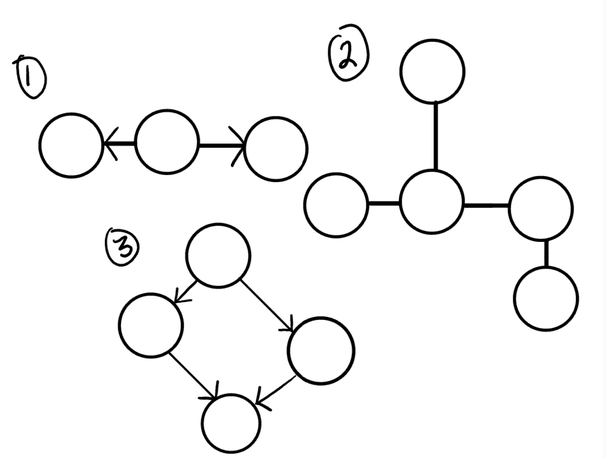
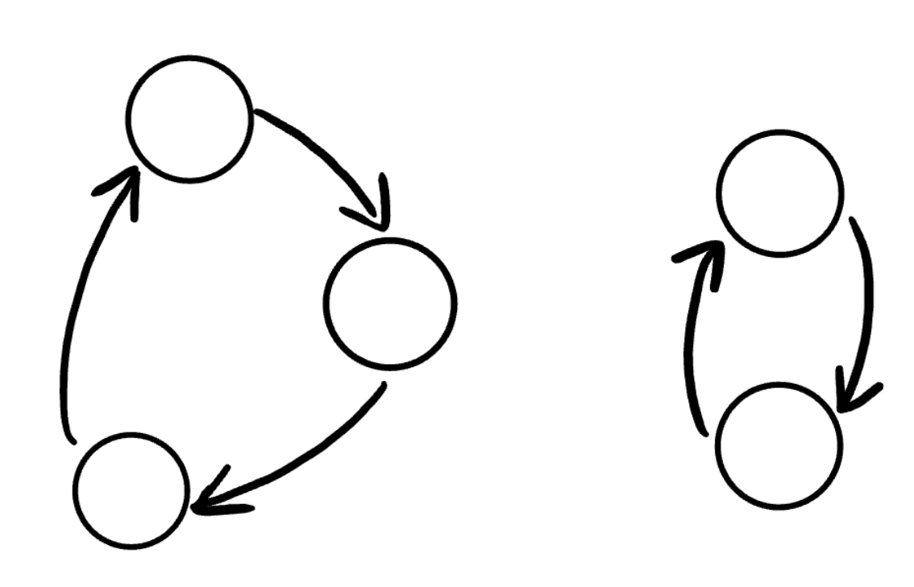
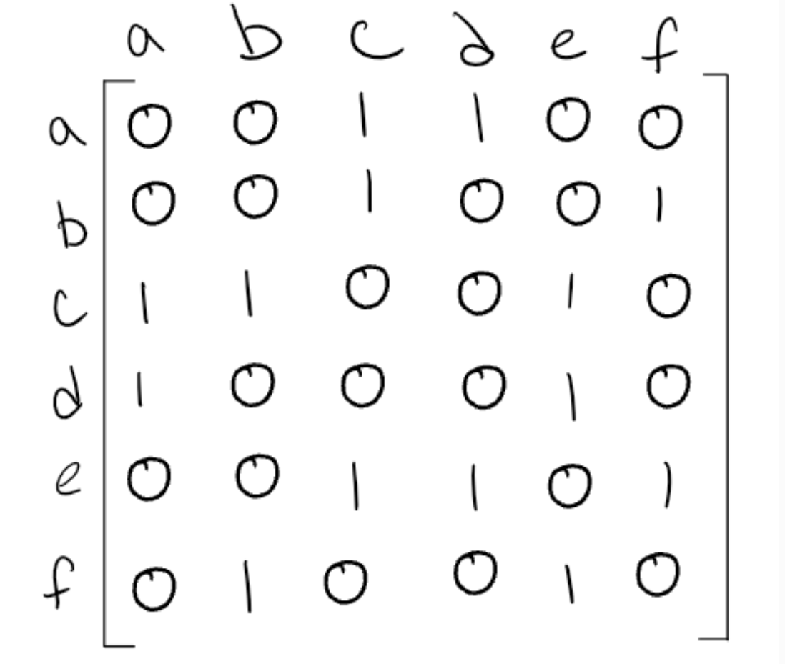
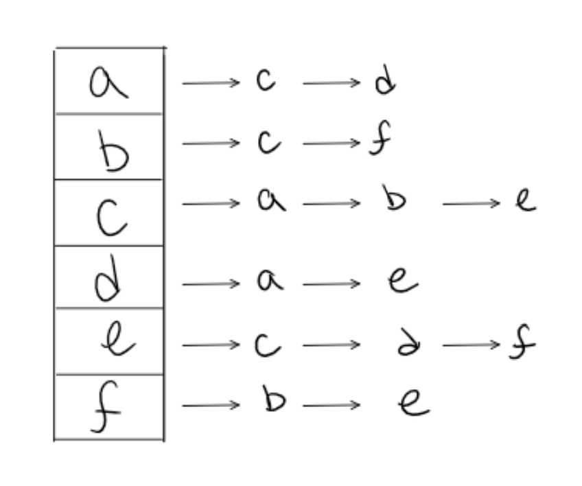
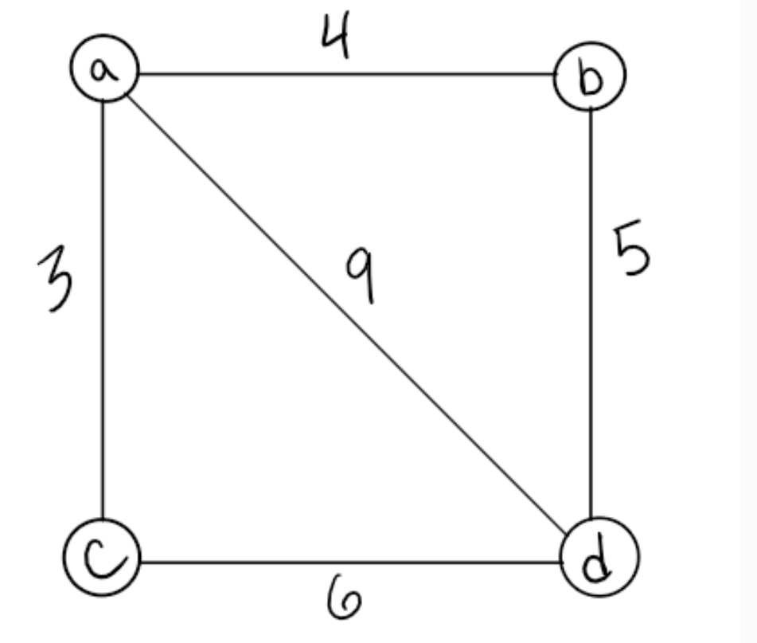
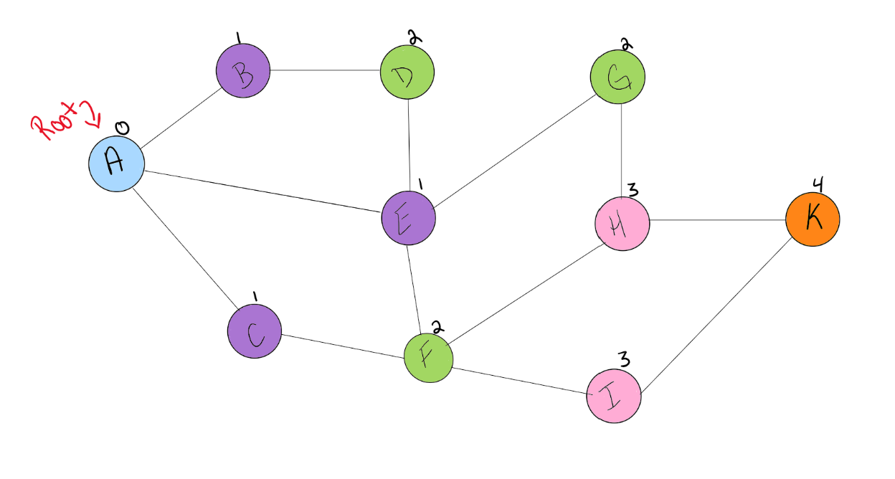

# Graphs

## Terminology
- Vertex - a data object that can have zero or more adjacent vertices
- Edge - a connection between two nodes
- Neighbor - the adjacent nodes that are connected via edges
- Degree - the number of edges connected to that vertex

## Directed vs Undirected
### Undirected Graphs
- graph where each edge is undirected or bi-directional
- the graph does not move in any direction

### Directed Graphs
- every edge has a direction
- each vertex is directed at another vertex with a specific direction

- Vertices = {a,b,c,d,e,f}
- Edges = {(a,c),(b,c),(b,f),(c,e),(d,a),(d,e)(e,c)(e,f)}

## Complete vs Connected vs Disconnected
- a complete graph is when all nodes are connected to all other nodes
- a connected graph is when all vertices on the graph have at least one edge
- a disconnected graph is where some vertices may not have edges

## Acyclic vs Cyclic
### Acyclic
- acyclic graph is a directed graph without cycles
- a cycle is when a node can be traversed and end up back at itself

### Cyclic
- a cyclic graph is a graph that cycles
- a cycle is defined as a path of a positive length that starts and ends at the same vertex

## Graph Representation
### Adjacency Matrix
- an adjacency matrix is represented by a 2D array
    - n vertices means we have n x n boolean matrix
- each row and column represents each vertex of the data structure
    - if there is an edge that connects the two, a one goes in the matrix
    - if there isn't a connection then there is a zero

- a sparse graph has few connections and a dense graph has many

### Adjacency List
- an adjacency matrix is a collection of linked lists or arrays that lists all of the other vertices that are connected

## Weighted Graphs
- a weighted graph is a graph with numbers assigned to the edges

- in a adjacency matrix of a weighted graph, the weight of the edge between the two vertices go in the 2D matrix instead of 1's and 0's
- with an adjacency list, include both the weight and the name of the adjacent vertex

## Traversals
### Breadth First
- in breadth first traversal you must decide a root, and then use a queue to enqueue all of the children. Continue this by creating a loop that dequeues a vertex and then adds all of it's children to the queue.
- This is similar to traversing a tree, but you must keep track of the already visited children so you don't end up in a cycle
- Algorithm
    1. Enqueue the declared start node into the queue
    2. create a loop that will run while the node still has nodes present
    3. dequeue the first node from the queue
    4. if the dequeue'd node has unvisited child nodes, add unvisited nodes to the visited set and enqueue them

### Depth First
- Depth first search is similar, but use a stack instead of a queue
- Algorithm
    1. Push the root node into the Stack and mark as visited.
    2. Start a while loop that runs as long as the stack is not empty.
    3. Pop the top node off of the stack and check its neighbors.
    4. If a neighbor hasn’t been visited, push it onto the stack and mark as visited.
    5. Repeat until the stack is empty.

### Links
[Graphs](https://codefellows.github.io/common_curriculum/data_structures_and_algorithms/Code_401/class-35/resources/graphs.html)