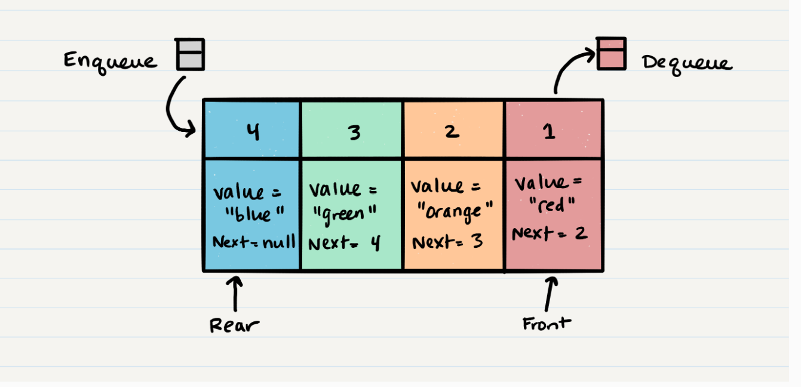

# Queue

## Common Terminology
1. Enqueue - nodes or items added to the queue
2. Dequeue - Nodes or items that are removed from teh queue
3. Front - the front/first node of the queue
4. Rear - This is the rear/last node in the queue
5. Peek - view the value of the front node in the queue
6. isEmpty - returns true when the queue is empty

## FIFO and LILO
- FIFO is the first item added to the queue will be the first one popped out
- LILO is the last item added to the queue will be the last one popped out

</br>




### Enqueue O(1)

```
ALGORITHM enqueue(value)
// INPUT <-- value to add to queue (will be wrapped in Node internally)
// OUTPUT <-- none
   node = new Node(value)
   rear.next <-- node
   rear <-- node
```

### Dequeue O(1)

```
ALGORITHM dequeue()
// INPUT <-- none
// OUTPUT <-- value of the removed Node
// EXCEPTION if queue is empty

   Node temp <-- front
   front <-- front.next
   temp.next <-- null

   return temp.value
```

### Peek O(1)
```
ALGORITHM peek()
// INPUT <-- none
// OUTPUT <-- value of the front Node in Queue
// EXCEPTION if Queue is empty

   return front.value
```

### IsEmpty O(1)
```
ALGORITHM isEmpty()
// INPUT <-- none
// OUTPUT <-- boolean

return front = NULL
```

