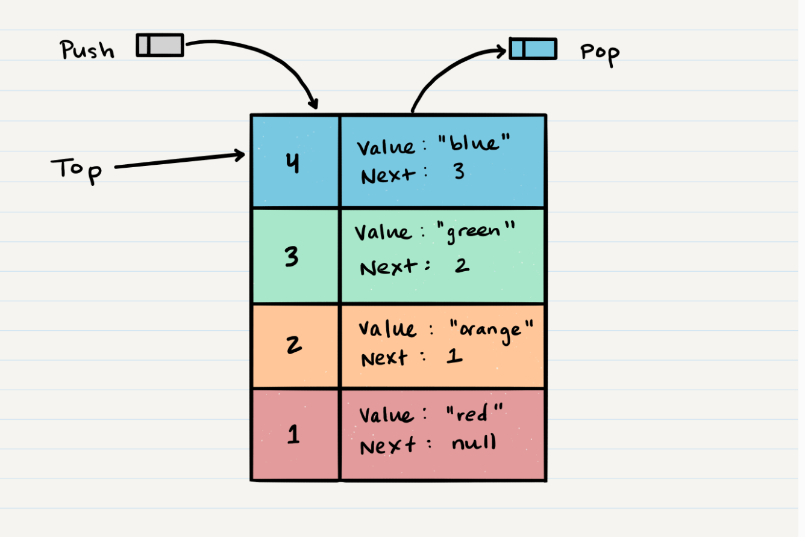

# Stacks

- A stack is a data structure with nodes that reference the next node, but not the previous

## Common Terminology
1. Push - nodes that are put onto the stack are pushed
2. Pop - nodes that are removed from the stack are popped
3. Top - the top of the stack
4. Peek - a peek is when you view the top Node in the stack, used when your trying to see if an empty stack exception will be thrown
5. IsEmpty - returns true when a stack is empty, otherwise returns false

## FILO and LIFO
- First in Last Out - The first item added to the stack will be the last popped out of the stack
- Last in First Out - This means that the last item added to the queue will be the first out

</br>



### Push O(1)
  - Add a node by setting the new node as the top and the previous top as the next reference for the new node

  ```
  ALOGORITHM push(value)
  // INPUT <-- value to add, wrapped in Node internally
  // OUTPUT <-- none
   node = new Node(value)
   node.next <-- Top
   top <-- Node
  ```

### Pop O(1)
  - Remove a node by setting the top node as current top node's next reference as the new top and then set the popped node next reference to null
  - It is a good idea to do a peek before popping so that an empty stack exception is not thrown
  
  ```
  ALGORITHM pop()
  // INPUT <-- No input
  // OUTPUT <-- value of top Node in stack
  // EXCEPTION if stack is empty

   Node temp <-- top
   top <-- top.next
   temp.next <-- null
   return temp.value
   ```

### Peek O(1)
  - Inspect the top of the node, return the value of the top node
  - It is a good idea to do an isEmpty before calling peek so that an empty stack exception is not thrown
  
  ```
  ALGORITHM peek()
  // INPUT <-- none
  // OUTPUT <-- value of top Node in stack
  // EXCEPTION if stack is empty

   return top.value 
  ```

  ### isEmpty O(1)
  - return true if the stack is empty and false if it isn't

  ```
  ALGORITHM isEmpty()
  // INPUT <-- none
  // OUTPUT <-- boolean

  return top = NULL
  ```